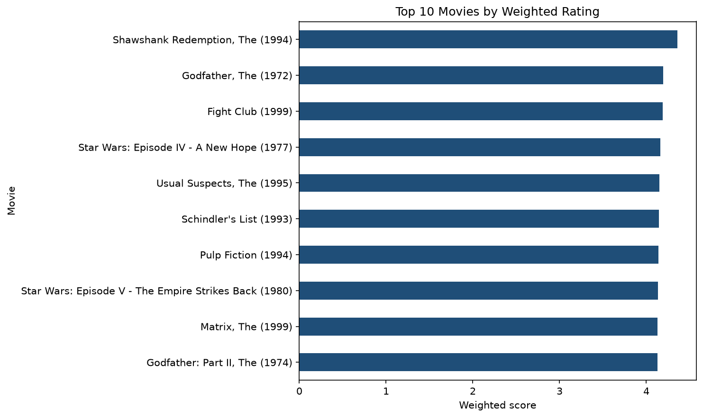

# DSA 4060 Week 1 Popularity Recommender

## Student

- Name: Arlen Ngahu
- ID number: 667855

## Project overview

This project explores MovieLens user-item ratings and builds two non-personalized movie recommendation baselines: a minimum-ratings popularity list and a weighted-rating list. Every user receives the same ranked list, which gives a transparent reference that later personalized models can be compared against.

## Dataset

MovieLens *latest-small* from GroupLens Research (University of Minnesota).

- Source: <https://grouplens.org/datasets/movielens/>
- Files used: `movies.csv` (9,742 movies) and `ratings.csv` (100,836 ratings from 610 users, 9,724 movies rated), unmodified
- Date accessed: 21 September 2026
- The dataset README and licence terms are kept in `data/ml-latest-small-README.txt`. The data may be redistributed under those same conditions and may not be used commercially without permission from GroupLens.

Citation: F. Maxwell Harper and Joseph A. Konstan. 2015. The MovieLens Datasets: History and Context. *ACM Transactions on Interactive Intelligent Systems* 5, 4, Article 19. <https://doi.org/10.1145/2827872>

## Methods

1. Rating-count and average-rating exploration (data validation, ratings per user and movie, rating distribution, sparsity)
2. Minimum-rating popularity baseline (at least 50 ratings, ranked by average rating)
3. Weighted-rating baseline: `(v / (v + m)) * R + (m / (v + m)) * C`, with `R` the movie average, `v` its rating count, `C` the overall mean rating (3.502) and `m` the 90th-percentile rating count (27)

## How to run

1. Clone the repository
2. Install packages: `pip install -r requirements.txt`
3. Place the required CSV files in `data/` if they are omitted
4. Open `notebooks/week1_popularity_recommender.ipynb`
5. Run all cells from top to bottom

## Key findings

- The data are very sparse: 98.30% of the possible user-movie cells are empty (610 users x 9,724 rated movies, 100,836 ratings).
- Ratings lean positive (most common rating 4.0, mean 3.50). Attention is highly concentrated: the median movie has 3 ratings, 3,446 movies have exactly one, and the most-rated 10% of movies hold 60% of all ratings.
- Average rating alone is unreliable: the ten highest averages are all exactly 5.0 and come from movies with only one or two ratings.
- Requiring at least 50 ratings leaves 450 eligible movies; *The Shawshank Redemption* ranks first. The weighted score (976 qualifying movies) also ranks it first, but the two Top 10 lists share only 4 titles. No weighted Top 10 title has fewer than 129 ratings, whereas the minimum-50 list includes a title with 57.
- The weighted ranking is stable at the top when the percentile changes (first place is unchanged at the 75th and 95th percentiles) and shifts mostly in the lower ranks.

Top 10 by weighted score:

| Rank | Movie | Ratings | Average | Weighted score |
|---|---|---|---|---|
| 1 | Shawshank Redemption, The (1994) | 317 | 4.43 | 4.356 |
| 2 | Godfather, The (1972) | 192 | 4.29 | 4.192 |
| 3 | Fight Club (1999) | 218 | 4.27 | 4.188 |
| 4 | Star Wars: Episode IV - A New Hope (1977) | 251 | 4.23 | 4.160 |
| 5 | Usual Suspects, The (1995) | 204 | 4.24 | 4.152 |
| 6 | Schindler's List (1993) | 220 | 4.22 | 4.146 |
| 7 | Pulp Fiction (1994) | 307 | 4.20 | 4.141 |
| 8 | Star Wars: Episode V - The Empire Strikes Back (1980) | 211 | 4.22 | 4.135 |
| 9 | Matrix, The (1999) | 278 | 4.19 | 4.131 |
| 10 | Godfather: Part II, The (1974) | 129 | 4.26 | 4.128 |

## Limitations

The recommendations are not personalized: only aggregate movie statistics are used, so every visitor sees the same list and niche tastes are not served. Recommending already-popular movies creates popularity bias, because they gain more exposure and therefore more ratings while lesser-known films rarely reach the evidence threshold. New movies have no ratings (cold start). The ratings span 1996 to 2018 and are a static snapshot, a rating does not reveal why a user liked a film, and the thresholds (50 ratings, 90th percentile) are policy choices that were not evaluated against held-out data.

## Repository structure

```
dsa4060-week1-recommender/
├── data/
│   ├── movies.csv                     MovieLens latest-small movie catalogue
│   ├── ratings.csv                    MovieLens latest-small ratings
│   └── ml-latest-small-README.txt     Dataset README and licence terms (GroupLens)
├── images/
│   └── top10_recommendations.png      Top 10 weighted-rating chart
├── notebooks/
│   └── week1_popularity_recommender.ipynb   Executed analysis notebook
├── .gitignore
├── README.md
└── requirements.txt
```

## Screenshot


